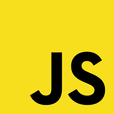

## Hi this is a Auto Reaction Discord Bot.

## It was code by Js Language .

## 🚀 Getting Started :
- Install [NodeJs](https://nodejs.org/en)
- Extract the files
- Open the console
- Type ```bach npm install```
- Configure the Config.js
- Run the bot by clicking Start.cmd

### ❓ If you face any issues please contact me at [Discord](https://discord.gg/VzSHHHAsTG)